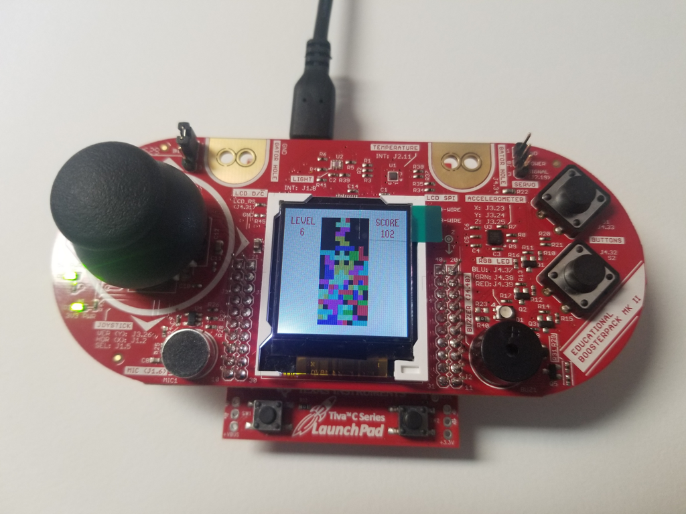

# MCU-Fourtris

This is a very simplified implementation of Tetris running on a [TI Launchpad](https://www.ti.com/tool/EK-TM4C123GXL) and it uses the [BoosterPack-MKII](https://www.ti.com/tool/BOOSTXL-EDUMKII) daughter board.

**NOTE:** I modified the Launchpad board by removing R9 and R10. According to a video I watched eons ago, the LCD won't work with those resistors installed. If you find out otherwise, let me know.

## Controls
Joystick - LEFT, RIGHT, DOWN do exactly what you expect.
Joystick button - hold to restart the game
S1 - clockwise rotation
S2 - counterclockwise rotation

## Additional comments

I'm aware that there are libraries that abstract the peripherals; I just wanted to configure all the registers myself.
